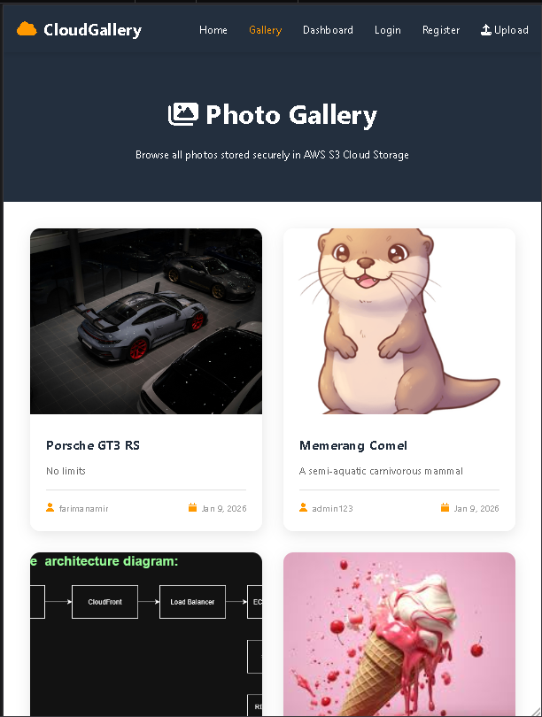
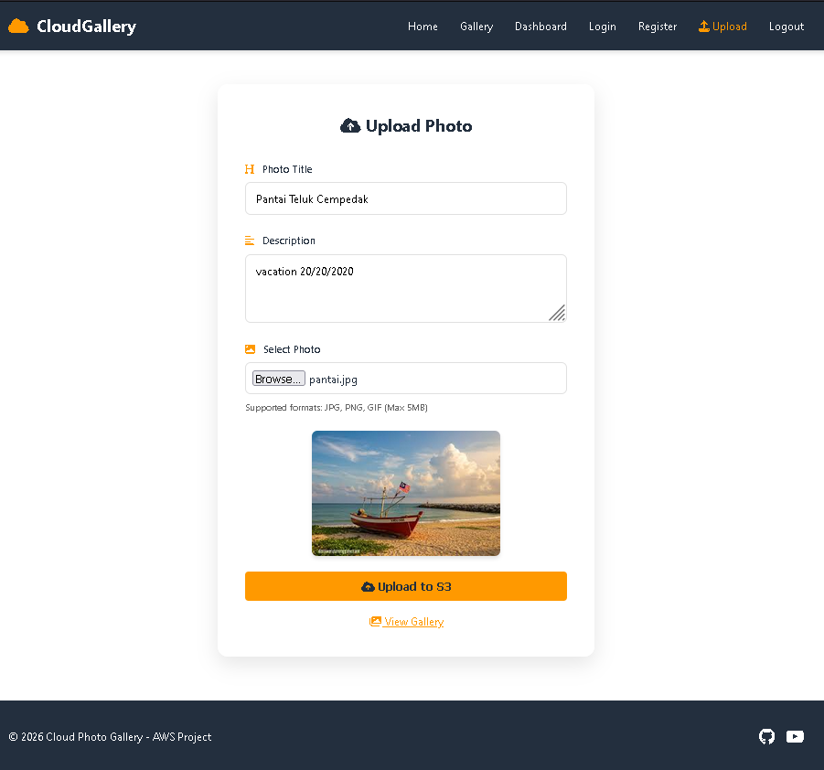

# AWS-materials-Project-Assignment

# Course Information
- **Course:** IIB43203 Cloud Computing
- **Institution:** [Your University]
- **Group Members:**
  1. [Name 1] - [Matrix No] - Infrastructure Lead
  2. [Name 2] - [Matrix No] - Database Lead
  3. [Name 3] - [Matrix No] - Application Lead
  4. [Name 4] - [Matrix No] - DevOps Lead

# Task for this group project:
Create a web application or a website based on Compute, Storage, Networking, and Database AWS Services

# Title Project: Cloud Photo Gallery - AWS Project

# Live Demo
🌐 **Website:** http://YOUR-EC2-PUBLIC-IP
📺 **Video Presentation:** [YouTube Link]

# AWS Services Used
- ✅ EC2 (Web Server)
- ✅ S3 (Photo Storage)
- ✅ RDS (MySQL Database)
- ✅ VPC (Networking)
- ✅ IAM (Security)

# Features
- User registration and authentication
- Photo upload to S3
- Gallery view with lightbox
- Responsive design
- AWS cloud integration

# Architecture
[Add your architecture diagram here]

## Installation
See [INSTALLATION.md](INSTALLATION.md) for complete setup guide.

## Screenshots
### Homepage


### Gallery


### Upload


## Team Contributions
- **Member 1:** VPC setup, Security groups, IAM roles
- **Member 2:** RDS setup, Database design
- **Member 3:** Frontend development, UI/UX
- **Member 4:** Backend development, AWS integration

## License
MIT License
```

**Screenshot this!** ✅
